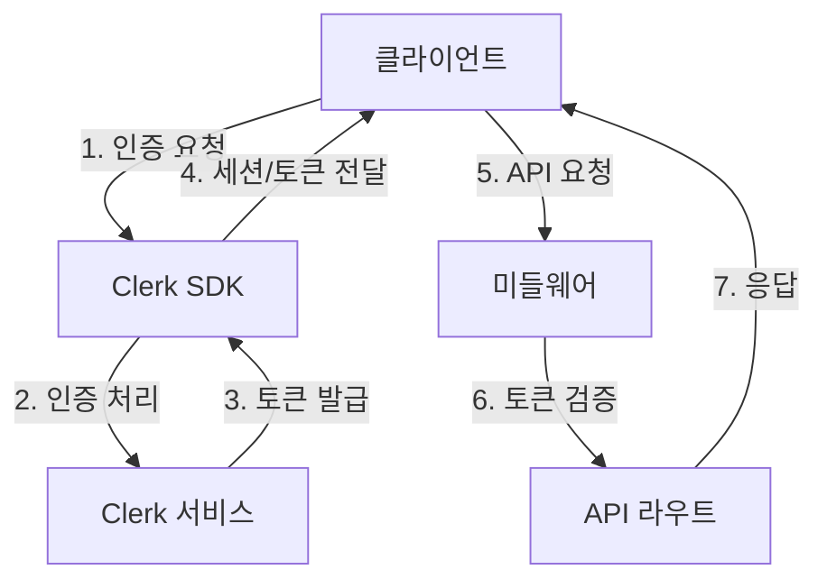

# Clerk 인증 시스템 아키텍처

## 1. 시스템 개요

### 1.1 아키텍처 다이어그램


### 1.2 인증 흐름
1. 사용자가 로그인/회원가입 시도
2. Clerk SDK가 인증 프로세스 처리
3. 인증 성공 시 세션 토큰 발급
4. 클라이언트에 세션 정보 저장
5. API 요청 시 미들웨어에서 세션 검증

## 2. 주요 구현 컴포넌트

### 2.1 ClerkProvider 설정
```typescript
// app/layout.tsx
import { ClerkProvider } from '@clerk/nextjs';

export default function RootLayout({
  children,
}: {
  children: React.ReactNode;
}) {
  return (
    <ClerkProvider>
      <html lang="ko">
        <body>{children}</body>
      </html>
    </ClerkProvider>
  );
}
```

### 2.2 미들웨어 구성
```typescript
// middleware.ts
import { authMiddleware } from "@clerk/nextjs";

export default authMiddleware({
  // 공개 접근 가능한 라우트 설정
  publicRoutes: [
    "/",
    "/blog(.*)",
    "/api/posts(.*)",
    "/api/comments/get(.*)"
  ],
  
  // 인증이 필요한 라우트 설정
  ignoredRoutes: [
    "/api/admin(.*)",
    "/api/comments/create(.*)",
    "/api/comments/delete(.*)"
  ]
});

export const config = {
  matcher: ["/((?!.*\\..*|_next).*)", "/", "/(api|trpc)(.*)"],
};
```

### 2.3 인증 UI 컴포넌트
```typescript
// components/common/auth/UserButton.tsx
import { UserButton, SignedIn, SignedOut, SignInButton } from "@clerk/nextjs";

export default function AuthButton() {
  return (
    <div>
      <SignedIn>
        <UserButton afterSignOutUrl="/" />
      </SignedIn>
      <SignedOut>
        <SignInButton mode="modal" />
      </SignedOut>
    </div>
  );
}
```

## 3. 권한 검증 전략

### 3.1 댓글 작성 권한 검증
```typescript
// app/api/comments/create/route.ts
import { getAuth } from "@clerk/nextjs/server";
import { NextResponse } from "next/server";

export async function POST(request: Request) {
  const { userId } = getAuth(request);
  
  if (!userId) {
    return new NextResponse("Unauthorized", { status: 401 });
  }

  // 댓글 생성 로직
  const data = await request.json();
  // ...댓글 처리 로직...
}
```

### 3.2 관리자 권한 검증
```typescript
// lib/auth/isAdmin.ts
import { currentUser } from "@clerk/nextjs";

export async function isAdmin() {
  const user = await currentUser();
  return user?.publicMetadata?.role === "admin";
}

// app/api/admin/route.ts
import { isAdmin } from "@/lib/auth/isAdmin";

export async function GET(request: Request) {
  if (!await isAdmin()) {
    return new NextResponse("Forbidden", { status: 403 });
  }
  // 관리자 기능 로직
}
```

## 4. 폴더 및 파일 구조

```
app/
├── api/
│   ├── comments/
│   │   ├── create/
│   │   │   └── route.ts
│   │   └── delete/
│   │       └── route.ts
│   └── admin/
│       └── route.ts
├── (auth)/
│   ├── sign-in/[[...sign-in]]/
│   │   └── page.tsx
│   └── sign-up/[[...sign-up]]/
│       └── page.tsx
components/
├── common/
│   └── auth/
│       ├── UserButton.tsx
│       └── AuthGuard.tsx
lib/
└── auth/
    ├── isAdmin.ts
    └── permissions.ts
middleware.ts
```

## 5. 인증 상태 관리

### 5.1 클라이언트 측 인증 상태
```typescript
// components/blog/CommentForm.tsx
import { useAuth } from "@clerk/nextjs";

export function CommentForm() {
  const { isLoaded, userId } = useAuth();

  if (!isLoaded) return <div>Loading...</div>;
  
  if (!userId) return <div>로그인이 필요합니다</div>;

  return (
    <form>
      {/* 댓글 작성 폼 */}
    </form>
  );
}
```

### 5.2 서버 컴포넌트에서 인증 상태
```typescript
// app/profile/page.tsx
import { currentUser } from "@clerk/nextjs";

export default async function ProfilePage() {
  const user = await currentUser();
  
  if (!user) redirect('/sign-in');

  return (
    <div>
      <h1>프로필</h1>
      <p>Welcome {user.firstName}</p>
    </div>
  );
}
```

## 6. 보안 고려사항

### 6.1 CSRF 보호
- Clerk에서 자동으로 CSRF 토큰 관리
- API 요청 시 자동으로 토큰 포함

### 6.2 세션 관리
- JWT 기반 세션 관리
- 자동 토큰 갱신
- 디바이스 관리 기능 제공

### 6.3 API 보안
- 모든 API 라우트에 자동 인증 검증
- Rate limiting 설정
- 요청 유효성 검증

## 7. 환경 설정

### 7.1 필요한 환경 변수
```env
NEXT_PUBLIC_CLERK_PUBLISHABLE_KEY=pk_test_...
CLERK_SECRET_KEY=sk_test_...
NEXT_PUBLIC_CLERK_SIGN_IN_URL=/sign-in
NEXT_PUBLIC_CLERK_SIGN_UP_URL=/sign-up
NEXT_PUBLIC_CLERK_AFTER_SIGN_IN_URL=/
NEXT_PUBLIC_CLERK_AFTER_SIGN_UP_URL=/
```

### 7.2 Clerk 대시보드 설정
1. 소셜 로그인 제공자 설정 (Google, GitHub)
2. 이메일 템플릿 커스터마이징
3. 웹훅 엔드포인트 설정
4. 사용자 메타데이터 스키마 정의
